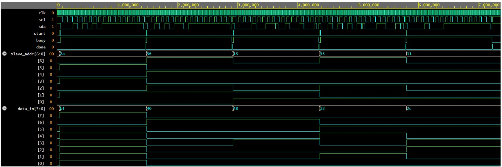

# Functional Verification of an I2C Master Controller using a Constraint-Random SystemVerilog Testbench

## Project Overview

This project implements the functional verification of an I2C (Inter-Integrated Circuit) Master Controller using a constraint-random SystemVerilog testbench. The verification environment is designed to validate the correctness of I2C read and write transactions by generating randomized test scenarios and automatically checking the DUT (Device Under Test) behavior.

The testbench follows a modular architecture consisting of a Generator, Driver, Monitor, and Scoreboard connected using mailboxes. Multiple randomized transactions are executed to verify address transmission, data transfer, acknowledgment handling, and control signals.

---

## Objectives

- Verify the functionality of an I2C Master Controller.
- Generate randomized read and write transactions using constrained randomization.
- Automatically drive transactions to the DUT.
- Monitor DUT outputs.
- Validate DUT behavior using a scoreboard.
- Analyze simulation waveforms.

---

## Features

- RTL implementation of an I2C Master Controller
- Constraint-random transaction generation
- Mailbox-based communication
- Generator
- Driver
- Monitor
- Scoreboard
- Randomized Read and Write operations
- ACK/NACK verification
- Busy and Done signal verification
- Waveform generation for debugging

---

## Project Structure

```
i2c-master-verification-systemverilog
│
├── RTL
│   └── i2c_master.sv
│
├── TB
│   └── i2c_tb.sv
│
├── Waveform
│   └── waveform.png
│
├── README.md
└── LICENSE
```

---

## Verification Environment

```
                +----------------+
                |   Generator    |
                +----------------+
                        |
                    Mailbox
                        |
                +----------------+
                |     Driver     |
                +----------------+
                        |
                +----------------+
                |      DUT       |
                | I2C Master RTL |
                +----------------+
                        |
                +----------------+
                |    Monitor     |
                +----------------+
                        |
                +----------------+
                |   Scoreboard   |
                +----------------+
```

---

## Design Description

The I2C Master Controller supports:

- START condition generation
- STOP condition generation
- 7-bit slave addressing
- Read operation
- Write operation
- ACK/NACK detection
- Busy status indication
- Transaction completion signal

---

## Verification Flow

1. The Generator creates randomized I2C transactions.
2. Transactions are passed to the Driver through a mailbox.
3. The Driver applies inputs to the DUT.
4. The DUT performs the I2C operation.
5. The Monitor observes DUT activity.
6. The Scoreboard validates the DUT outputs.
7. Simulation waveforms are generated for analysis.

---

## Constraint Randomization

### Slave Address Constraint

```systemverilog
constraint addr_c {
    addr inside {[7'h10:7'h60]};
}
```

### Read / Write Distribution

```systemverilog
constraint rw_c {
    rw dist {0:=1, 1:=1};
}
```

---

## Testbench Components

| Component | Description |
|-----------|-------------|
| Interface | Connects DUT and verification environment |
| Transaction | Stores randomized transaction data |
| Generator | Creates randomized transactions |
| Driver | Drives DUT inputs |
| Monitor | Observes DUT outputs |
| Scoreboard | Compares expected and actual results |
| Environment | Connects all verification components |

---

## Tools Used

- SystemVerilog
- Icarus Verilog
- GTKWave
- GitHub

---

## Simulation Result

The randomized transactions were executed successfully, and the scoreboard verified the DUT functionality.

Example Scoreboard Output:

```text
==================================================
SCOREBOARD REPORT
PASS = 5
FAIL = 0
==================================================
```

---

## Simulation Waveform

The waveform below demonstrates successful execution of multiple randomized I2C transactions, including:

- START condition
- Slave address transmission
- Read and Write operations
- ACK detection
- Busy signal assertion
- Transaction completion
- STOP condition



---

## Future Improvements

- Functional Coverage
- Code Coverage
- Assertion-Based Verification (SVA)
- UVM-based Verification Environment
- Multi-slave support
- Error Injection Tests
- Clock Stretching Verification

---

## Authors

ECE Mini Project

**Project Title:** Functional Verification of an I2C Master Controller using a Constraint-Random SystemVerilog Testbench
